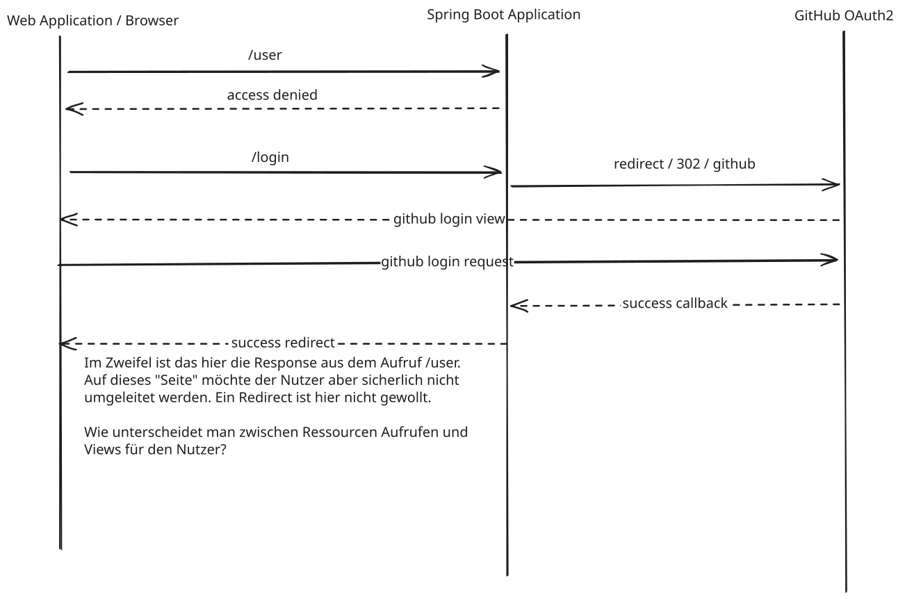

# Sammlung von oauth2 Beispielen

## oauth2 mit Spring Boot

### SpringSecurity
* Alle statischen Resourcen sollten frei zugänglich sein (siehe in `ApplicationConfiguration` #permitAll())
  Insbesondere alle Javascript, favicon.ico, index.html und sonstige Dateien, die für das initiale Starten
  der Web-Anwendung nötig sind.
* Alle REST Endpunkte sollten unterhalb einer URL liegen z.B. /api/** (Siehe auch den nächsten Punkt).
* `#oauth2Login(login -> login.defaultSuccessfulUrl("/", alwaysUse: true)`
  TODO: Ohne diese Angabe würden alle geschützten REST Abfragen, die ein Login erzwingen, im anschließendem
  Redirect in der JSON Response landen und diese dem Nutzer anzeigen.
  
  

## FAQ

* Frage: 
  Why do i need the CsrfCookieFilter? The AplicationConfiguration already defines in line 25 a `CookieCsrfToeknRepository?

  Short answer: you don't always need CsrfCookieFilter — CookieCsrfTokenRepository.withHttpOnlyFalse() will create the cookie in many setups — but the filter is a safety-net to guarantee the cookie exists/gets refreshed for the SPA on every relevant response.

  Why I added the filter (concise)

  CookieCsrfTokenRepository writes the cookie when the CSRF token is saved by the repository; in many Spring setups that happens automatically, so the cookie is present.
  However, initial SPA page loads, static-resource handling, some proxy/caching setups, or custom request flows can deliver the page before the repository saves/writes the cookie. The CsrfCookieFilter reads the CsrfToken request attribute and explicitly sets/refreshes the XSRF-TOKEN cookie (with HttpOnly=false) so JS can always read it.
  The filter also handles token refreshes and ensures the cookie path/flags are set exactly how the SPA  expects.
  When you can remove the filter

  If you verify locally that hitting / (or your SPA entry) always returns Set-Cookie: XSRF-TOKEN=... from CookieCsrfTokenRepository on the initial GET, and your SPA reliably reads it, then the filter is redundant and can be removed.
  If you serve index.html via Spring MVC behind the security filter chain and you see the cookie set consistently, CookieCsrfTokenRepository.withHttpOnlyFalse() alone is sufficient.
  Recommendation

  Keep the filter for robustness (especially during development or when the SPA might be cached/served differently). If you prefer minimal code, remove it and I can run the app and verify the cookie is present on the initial GET so you can be confident it’s safe to delete.

* Frage:
  CSRF — was das ist:

  Definition: Cross‑Site Request Forgery (CSRF) ist ein Angriff, bei dem ein bösartiger Web‑Aufruf (z. B. ein Formular-POST oder ein fetch) im Kontext einer authentifizierten Sitzung des Opfers an eine vertrauenswürdige Website gesendet wird.
  Kernproblem: Browser senden automatisch Auth‑Cookies (Session‑Cookies), deshalb kann ein fremder Host Aktionen im Namen des eingeloggten Nutzers auslösen.
  Was geschützt werden muss: alle zustandsändernden Endpunkte (POST/PUT/DELETE/PATCH), nicht lesende GET/HEAD sind normalerweise ausgenommen.
  Wie CSRF typischerweise verhindert wird:

  Synchronizer Token (serverseitig): Server generiert pro Sitzung/Request ein CSRF‑Token, rendert/es in Form (hidden field) oder liefert es an den Client; Server validiert Token bei eingehenden schreibenden Requests.
  Double‑Submit Cookie: Server setzt ein Cookie mit Token; Client liest Cookie und sendet Token zusätzlich als Header/body; Server vergleicht Cookie↔Header.
  SameSite‑Cookies: SameSite=Lax/Strict verhindert, dass Cookies bei Cross‑Site‑Requests mitgesendet werden (wirksam für viele Fälle).
  Origin/Referer‑Check: Server prüft Origin/Referer Header bei CORS/POSTs (robust, aber ggf. fehlschlagend bei Proxys).
  Bearer-Token im Authorization‑Header: Browser füllt Header nicht automatisch ein — CSRF entfällt, aber XSS‑Risiko bleibt (wenn Token unsicher gespeichert ist).

* Frage:
  Unterschiede: SPA vs. JSP/MVC (Server‑rendered) — praktische Auswirkungen:

  Formen werden serverseitig gerendert — das CSRF‑Token wird oft direkt als hidden Feld in das Formular eingebettet (Synchronizer Token).
  Frameworks (z. B. Spring Security) fügen standardmäßig CSRF‑Filter hinzu und prüfen Token bei Form‑Submits.
  Einfach umzusetzen: Token in HTML, geprüft bei Postback.
  SPA (Single Page Application) mit API‑Backend:

  SPA sendet Requests per XHR/fetch; oft wird JSON in Body verwendet (keine klassischen HTML‑Formen).
  Wenn Auth über Cookies läuft (Session‑Cookie oder HttpOnly Cookie), besteht weiterhin CSRF‑Risiko — weil Browser Cookies automatisch mitsenden. Schutz nötig (z. B. double‑submit, synchronizer token über API).
  Wenn Auth per Authorization: Bearer <token> erfolgt und Token manuell vom JS gesetzt wird, werden solche Requests nicht vom Browser automatisch „geforged“ — CSRF‑Angriffe sind damit unwahrscheinlicher. Achtung: Speicherung des Tokens (localStorage) erhöht XSS‑Risiko.
  SPA‑typische Patterns: Backend setzt ein nicht‑HttpOnly CSRF‑Cookie, SPA liest Cookie und schickt Token als Header bei schreibenden Requests; Session‑Cookie bleibt HttpOnly. Oder Backend verlangt Authorization Header (Token im Speicher).
  CORS + credentials: Wenn API CORS mit Access‑Control-Allow‑Credentials: true erlaubt, muss Backend besonders strikt sein (Origin‑Whitelist, CSRF Token).
  Praxisempfehlungen kurz:

  Wenn du Cookies für Auth nutzt: immer CSRF‑Token oder SameSite streng konfigurieren.
  Für SPAs: bevorzugt Authorization Header mit Token, das nur im Arbeitsspeicher gehalten wird (verringert CSRF, erhöht aber XSS‑Vorsicht). Oder wende double‑submit / synchronizer token an (Server setzt Token‑Cookie, SPA liest und sendet Header).
  Setze Cookies Secure, HttpOnly (für Session) und SameSite passend. Prüfe Origin/Referer zusätzlich.
  Schütze vor XSS — CSRF‑Gegenmaßnahmen sind nutzlos, wenn Angreifer JS ausführen kann.
  Wenn du willst, kann ich das für dieses Projekt konkret prüfen (z. B. CsrfCookieFilter.java und Spring‑Konfiguration anschauen) und konkrete Empfehlungen oder Patches vorschlagen. Soll ich das tun?